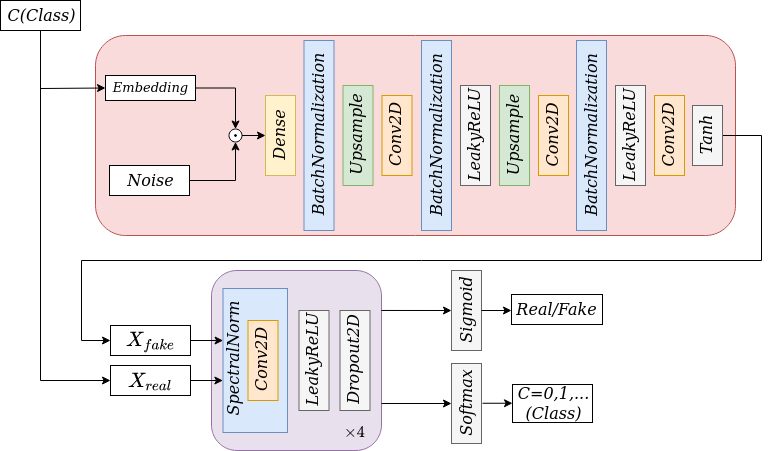

# AC-GAN

## Description
 
This repository folder contains an implementation of an Auxiliary Classifier GAN (AC-GAN) for image synthesis. The AC-GAN architecture is illustrated below.

<p align="center">
   
</p>

As we already introduced, it is an extension of the GAN architecture that adds structure to the latent space. The training of the GAN model is changed so that the generator is provided both with a point in the latent space and a class label as input, and attempts to generate an image for that class. The main difference is in the discriminator model which is provided with both an image and the class label and must classify whether the image is real or fake as before.

## Implementation

From the appendix of the AC-GAN [paper](https://arxiv.org/abs/1610.09585) introduced by Augustus Odena, et al., it is provided suggestions for generator and discriminator configurations that we use as reference. However, our final proposed architecture fall far short of them. Moreover, our implemented architecture leverages from the DC-GAN and SN-GAN experiments conducted with our ISIC dataset, please refer to [DC-SN-GAN](https://github.com/mestecha/AIDL21-SAGAN/tree/main/DC-SN-GAN) for more details. Also, a strong influence involved in decision making has been [this](https://github.com/soumith/ganhacks#16-discrete-variables-in-conditional-gans) page in spite of being deprecated.

Right below is shown a replica of the architecture implemented for our Auxiliary Clasiffier. A first pleasent detail is the elementwise multiplication for the label conditioning instead of the standard concatenation. This was a decision adopted to avoid increasing the input dimension while adding the label information. Other AC-GAN implementations adopted other strategies such as replacing the first *N* elements of the random normal noise vector, with *N* being the number of classes to take into account by the network.

We have not adopted the classical deconvolution or transposed convolutions attempting to avoid the famous annoyed [Checkerboard Artifacts](https://distill.pub/2016/deconv-checkerboard/). Instead, we have implemented a standard upsample followed by a convolutional layer. Unlike deconvolution, this approach to upsampling shouldn’t have artifacts as its default behavior. Ideally, it would go further, and be biased against such artifacts.

<p align="center">
   
</p>

Harnessing the spectral normalization properties described in [DC-SN-GAN](https://github.com/mestecha/AIDL21-SAGAN/tree/main/DC-SN-GAN) and [here](https://openreview.net/forum?id=B1QRgziT-), we have also adopted for the AC-GAN discriminator as a good regularizer. 

Addressing the outputs of the discriminator, the first output is a single probability via the sigmoid activation function that indicates the “realness” of the input image and is optimized using binary cross entropy like a normal GAN discriminator model. 

The second output is a probability of the image belonging to each class via the softmax activation function, like any given multi-class classification neural network model, and is optimized using categorical cross entropy.

## Dependencies

- Python 3.7
- [PyTorch](http://pytorch.org) 1.7.1+cu110
- [NumPy](http://www.numpy.org/) 1.20.1
- [PIL](http://pillow.readthedocs.io/en/3.1.x/installation.html) 8.1.0
- [PIQA](https://pypi.org/project/piqa/)  1.1.3

## Execution

Run the following command for details of each arguments.
```bash
$ python main.py -h
```
You should specify the path to the dataset you are using with argument --path. In this folder is expected to be the images within a folder named **'Images'** and the **'train_data.csv'** metadata file which can be found [here](https://github.com/mestecha/AIDL21-SAGAN/tree/main/Data). For downloading the images, please refer to ISIC [API](https://isic-archive.com/api/v1/#/). For convenience, there is available in [this](https://github.com/GalAvineri/ISIC-Archive-Downloader) repository a useful script which can download the entire ISIC archive automatically.

## Checkpoints files

Please find in the following links some of the checkpoints files generated every 100 epochs for both 64x64 and 128x128 images size runs. There are available the checkpoints for both Generator and Discriminator models. 

* :inbox_tray: [ckpt](https://drive.google.com/drive/folders/1xd0H8pSC0pl99TbbItDuYoGmyNEdZC9x?usp=sharing)

Once downloaded unzip the content within the **'output/ckpt'** folder, the script will automatically take the latest ckpt file available if applicable.

## Results

Leveraging again from the findings of the experimients conducted for the DC-GAN and SN-GAN, we have subsequently trained and tested our AC-GAN. For both 64x64 and 128x128 resolutions we have obtained the following results.


Metric   | 64x64  | 128x128 | 
:------: | ------:| ------: |
PSNR     | 12.17  | 11.81   |
SSIM     |  0.32  |  0.39   |
MS-GMSD  |  0.27  |  0.25   |
MDSI     |  0.49  |  0.47   |
HaarPSI  |  0.31  |  0.31   |

Below are shown some images obtained from the trained network along with some loss charts from the Generator and Discriminator training.

- #### 64x64 resolution

<p align="center">
    
</p>

<p align="center">
  
   
</p>


<p align="center">
    
</p>
