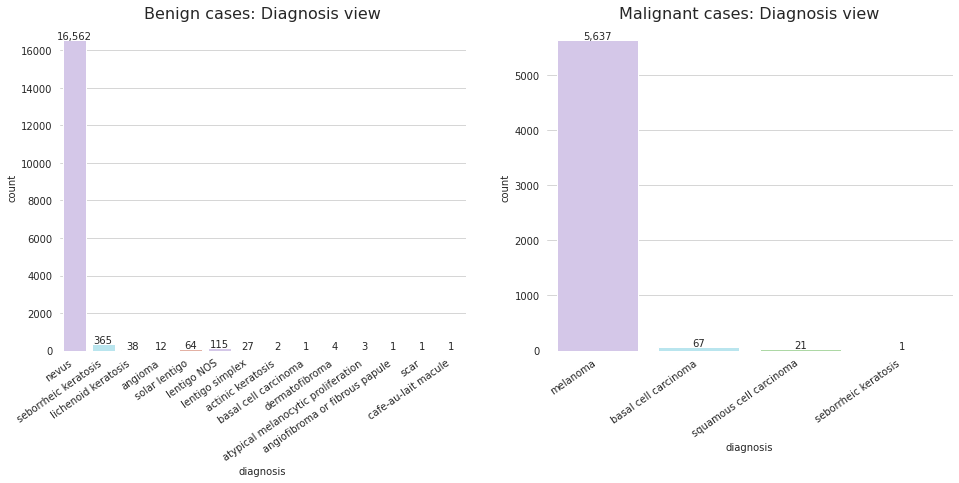
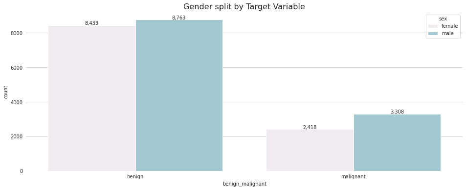
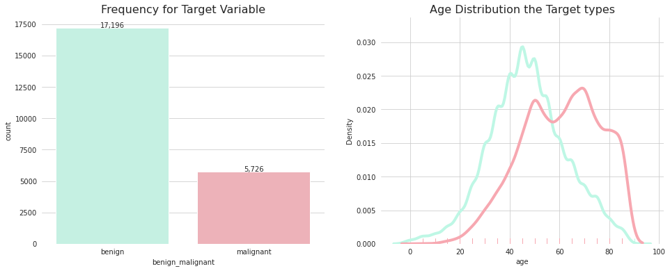

# AIDL21: GAN-based synthetic medical image augmentation

This repository contains different Generative Adversarial Networks (GANs) implementations to explore methods for synthetic data augmentation . They all are dedicated to Artificial Image Synthesis in the context of Medical imaging data.

Our project aims to display the effectiveness of synthetic  data generation as a form of image augmentation technique to improve the predictive classification performance of a scaled up Convolutional Neural Network (CNN) known as EfficientNet, proposed in [ICML 2019](https://arxiv.org/pdf/1905.11946.pdf). Therefore we suggest an augmentation scheme that  is  based  on  combination  of  standard  image  perturbation  and  synthetic  dermatologic  lesion  generation  using  GAN  for improved skin cancer classification.

### About
Final Project for the UPC [Artificial Intelligence with Deep Learning Postgraduate Course](https://www.talent.upc.edu/ing/estudis/formacio/curs/310402/postgraduate-course-artificial-intelligence-deep-learning/) 2020-2021 online edition, authored by:

* [Alexis Molina](https://www.linkedin.com/in/alexismolinamr/)
* [Antonio Castaño](https://www.linkedin.com/in/antoniocasblan/)
* [Guillermo Oyarzun](http://www.cttc.upc.edu/?q=user/93)
* [Marcos Estecha](https://www.linkedin.com/in/marcos-estecha-07a54a113)

Advised by [Santiago Puch](https://www.linkedin.com/in/santipuch)

## Table of Contents 

- [1. Introduction](#1-intro)
    - [1.1. Motivation](#11-motivation)
    - [1.2. Objectives](#12-milestones)
- [2. Corpora](#2-available-datasets)
    - [2.1. Data Description](#21-eda)
    - [2.2. Pre-processing](#22-preprocessing) 
- [3. Deep Neural Networks Models](#3-dnns)
    - [3.1. Generative Adversarial Networks (GANs)](#31-gans)
        - [DC-GAN](#DC-SN-GAN)
        - [W-GAN](#W-GAN)
        - [AC-GAN](#AC-GAN)
        - [SN-GAN](#DC-SN-GAN)
    - [3.2. EfficientNet](#32-efficientnet) 
- [4. Environment Requirements](#4-envs)
    - [4.1. Software](#41-software)
    - [4.2. Hardware](#42-hardware)
- [5. Results](#5-results)
    - [5.1. Evaluation Metrics](#51-metrics)
- [6. Conclusions](#6-conclusions) 
 
 
## 1. Introduction 

Over the last decade Deep Neural Networks have produced unprecedented performance on a number of tasks, given sufficient data. One of the main challenges in the medical imaging domain is how to cope with the small datasets and limited amount of annotated samples, especially when employing supervised machine learning algorithms that require labeled data and larger training examples.

An attemp to overcome this challenge, the researchers adopted data augmentation schemes, commonly including simple modifications of dataset images such as translation, rotation, flip and scale. However, little additional information can be gained from the diversity provided by these techniques.

On the other hand, since their introduction by [Goodfellowet al.](https://papers.nips.cc/paper/5423-generative-adversarial-nets), Generative Adversarial Networks (GANs) have become the defacto standard for high quality image synthesis. There are two general ways in which GANs have been used in medical imaging. The first is focused on the generative aspect and the second one in the discriminative aspect. Focusing on the first one, GANs can help in exploring and discovering the underlying structure of training data and learning to generate new images. This property makes GANs very promising in coping with data scarcity and patient privacy.

### 1.1. Motivation 

Skin cancer is the most prevalent type of cancer. Melanoma, specifically, is responsible for 75% of skin cancer deaths, despite being the least common skin cancer. As with other cancers, early and accurate detection—potentially aided by data science—can make treatment more effective. With the advance of the medical imaging informatics, there is an effort improving the melanoma diagnosis via new AI approaches. For that purpose, sufficient data volume is necessary for training a successful machine learning algorithm for medical image analysis. However, there is inherent problematic in the field of medical imaging where abnormal findings are by definition uncommon. The paucity of annotated data and class imbalance of insufficient variability leads to poor classification performance.

In this project we have explored the possibilities of applying different flavors of GANs given their potential as an augmented method for image representation and classification.

### 1.2. Objectives 

Above all the main purpose of this project is to demonstrate the potential solution to the problem of insufficiency data volume in the medical domain by means of comparing the proposed CNN-based classifier performance using standard against synthetic image augmentation. To tackle this task, it can be further broken down into the following sub-objectives:
- Explore, clean and process the data that will be used for training and evaluating the implemented Deep Neural Networks.
- Research, develop, implement and train a clasiffier model. This classifier will be based on a scaled up CNN whose function will be to detect malign dermathological lesions from the different augmented images.
- Perform classifier performance tests. In order to establish a solid base evaluation model to compare with, there wil be necessary to undertake several experiments for fine tuning the model for the training data appropriately.
- Research, develop, implement and train a series of GANs-based models to be able to demosntrate how much we can improve the performance of the classifier.
- Carried out a series of experiments comparing the performance of the classifier using standard augmentation over the training data with regard to the performance obtained using the synthetic data obtained from the differents GANs.
- Draw final conclusions from all the experiments conducted and the different improvements attempted.

## 2. Corpora 

For the data training sets have made use of the dataset provided by the healthcare organization for informatics in medical imaging, the [Society for Imaging Informatics in Medicine (SIIM)](https://siim.org/) joined by the [International Skin Imaging Collaboration (ISIC)](https://www.isic-archive.com/#!/topWithHeader/wideContentTop/main). 

After some filtering for rebalancing the missing or non-labeled images and cutting off the excess of bening lesions, we finish with a total number of 22,922 images split in Train (16,045 observations) and Test (6,877 observations).

  

### 2.1. Data Description  

Through the API available in the ISIC home page we have been able to download all the images collection with its descriptions associated. The whole database is about 110 gigabytes (GB). The format of the colour images is both JPEG and PNG with a high variety of resolution sizes. Each image has a corresponding JSON-based description file with the image matadata information. From these metadata files we have been conducted a quick Exploratory Data Analysis (EDA) to acquire more awareness of how distributed it is. Initially, there were 27 matadata fields from which we later filtered out and kept only 8 of them. Some meaningful classes worthy to mention are the dcm_name field which identifies the image associated; the benign_malignant class from which we later classify; and finally the diagnosis class which details the diagnosis of the dermathological image lesion is referred to.

  

As we mention, we carried out a genlty Data Wrangling with which we obtain some useful insght about the images data handling. From this procedure we have verified that there is a very high target class imbalance which need to take in consideration when Modeling.

   
  

### 2.2. Pre-processing   

## 3. Deep Neural Networks Models 
### 3.1. Generative Adversarial Networks (GANs)  

- [DC-GAN](DC-SN-GAN)

A DCGAN is a specific flavor of GAN dedicated to image generation. The architecture consists on a _Generator_ and a _Discriminator_ built upon four 2d convolutional layers. It was first described by _Radford et. al._ in this [paper](https://arxiv.org/pdf/1511.06434.pdf). The _Discriminator_ in build out of strided convolutions, batch normalization layers and uses Leaky Relu activations. Originally, the input size of the images is 64 and it is already set to process color images (3x64x64). The _Generator_ differs from the _Discriminator_ in the convolutional layers, which are transposed. It has as an input a random vector sampled from a normal distribution which will be transformed by adversarial training into an RGB image of the selected shape.

  

- [W-GAN](W-GAN)

The Wasserstein GAN (WGAN) is a variant to the traditional implementation of the generative adversarial networks for improving the training phase. The adversarial loss aims at finding the Nash equilibrium, which in practice is difficult to achieve and it may result in model oscillation and mode collapse. The idea behind the WGAN is to stabilize the model training by focusing on minimizing an approximation of the Earth-Mover's distance (EM) rather than the Jensen-Shannon divergence as in the original GAN formulation. Moreover, the discriminator is changed by a critic that scores the realness or fakeness of a given image. 
By doing so, the loss of the discriminator seems to relate with the quality of the images generated by the model. 

- [AC-GAN](AC-GAN)

- [SN-GAN](DC-SN-GAN)

The SNGAN is identical to DCGAN but implements _Spectral Normalization_ to deal with the issue of exploding gradients in the _Discriminator_. 

Spectral normalization is a weight regularization technique with is applied to the GAN's _Discriminator_ to solve the issue of exploding gradients. Is works stabilizing the training process of the _Discriminator_ through a rescaling the weights of the convolution layers using a norm (spectral norm) which is calculated using the power iteration method. The method is triggered right before the _forward()_ function call.

In more detail, spectral normalization deals with Lipschitz constant as its only hyper-paramenter. This constant refers to a regularization property of continuous functions which bounds its values. More precisely, the Lipschitz constant equals the maximum value of the derivatives of the function. In out particular case, since the activation function is a LeakyRelu, this constant takes the value 1. 

Spectral normalization controls this parameter in the discriminator by bounding it through the spectral norm. The Lipschitz norm  is equivalent to the superior bound of the gradient of the layer , where  is defined as the spectral norm of the matrix A. That gives,

,

which is the largest singuler value of A and **h** is the linear layer.

With the above definition of a linear layer, when passing weights through as , the norm of the layer is defined as,

.

Therefore, spectral normalization of a given passing weight **W** normalizes the weight of each layer and thus, the whole network, mitigaiting explosion gradient problems.

Some works refer to DCGANs that implement spectral normalization as SNGANs, which is also done in this work. SNGAN with the best parameters and implementations described in the respective folder was the one used for the image generation.

### 3.2. EfficientNet   

## 4. Environment Requirements 
### 4.1. Software  

The project has been developed using the PyTorch framework due to our familiarization during the postgraduate program. The input files are read using the YAML language that facilitates the human interpretability. Moreover, the package Pytorch Image Quality Assessment (PIQA) is used to generate the metrics that evaluate the quality of the synthetic images.
 

### 4.2. Hardware   

The GANs were trained using Google Colab. This work environment provided us an easy way to work in teams and to access to GPUs.
The Classifier also started as a Google Colab project, however, due to its high computing demands, we were forced to port it to Google Cloud to avoid the time limit of the Colab.  

- Google Cloud Platform

## 5. Results 
### 5.1. Evaluation Metrics  

Since we lack from any medical expertise for assessing the quality of the generated images, we have implemented several metrics to measure traits of our output pictures.

- #### Peak Signal-to-Noise Ratio (PSNR)

This metric is used to measure the quality of a given image (noise), which underwent some transformation, compared to the its original (signal). In our case, the original picture is the real batch of images feeded into our network and the noise is represented by a given generated image.

- #### Structural Similarity (SSIM)

SSIM aims to predict the percieved the quality of a digital image. It is a perception based model that computes the degradation in an image comparison as in the precived change in the structural information. This metric captures the perceptual changes in traits such as luminance and contrast.

- #### Multi-Scale Gradient Magnitude Similarity Deviation (MS GMSD)

MS-GMSD works on a similar version as SSIM, but it also accounts for different scales for computing luminance and incorporates chromatic distorsion support.

- #### Mean Deviation Similarity Index (MDSI)

MDSI computes the joint similarity map of two chromatic channels through standard deviation pooling, which serves as an estimate of color changes. 

- #### Haar Perceptural Similarity Index (HaarPSI)

HaarPSI works on the Haar wavelet decomposition and assesses local similarities between two images and the relative importance of those local regions. This metric is the current state-of-the-art as for the agreement with human opinion on image quality. 

- #### Measure Assessment

Measure | Bar | 
:------: | :------:|
PSNR   | Context dependant, generally the higher the better.  | 
SSIM   |  Ranges from 0 to 1, being 1 the best value.     | 
MS-GMSD |  Ranges from 0 to 1, being 1 the best value.    |  
MDSI   |   Ranges from 0 to inf, being 0 the best value.    |
HaarPSI |   Ranges from 0 to 1, being 1 the best value.   |

### Experiment Metrics Values and Synthetic Images

Architecture | PSNR | SSIM |MS-GMSD |MDSI |HaarPSI |
:------: | :------:| :------:| :------:| :------:|:------:|
DC-GAN |   12.92  | 0.35   | 0.29   |  0.45 | 0.39 |    
AC-GAN |           |       |       |      |         |
W-GAN |           |        |       |     |         |
SN-GAN |  12.21  |   0.21   |   0.26   |   0.49  |  **0.41**  |  
SN-GAN 128 |  12.18  |   0.24   |   0.15   |   0.52  |  **0.45**  |  

- #### DCGAN 64x64

- #### SNGAN 64x64

- #### SNGAN 128x128

## 6. Conclusions 
